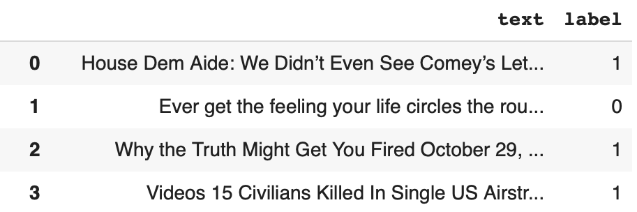
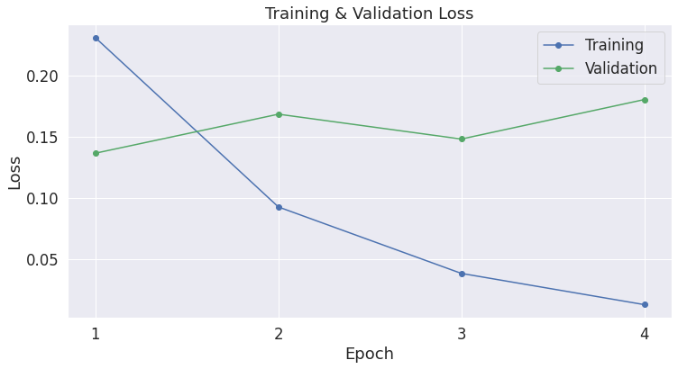
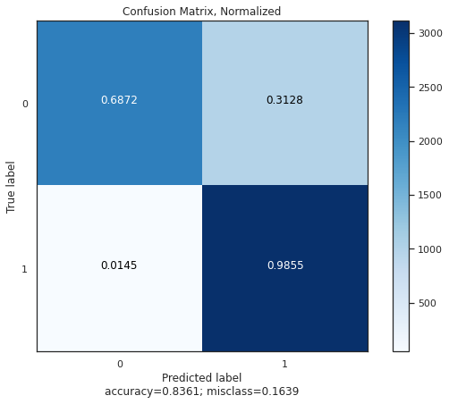
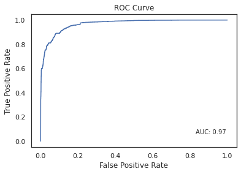

# BERT_FakeNewsClassifier
BERT, acronimo di *Bidirectional Encoder Representation From Transformers* è un framework basato su reti neurali per il Natural Language Processing. 
Il task su cui è stato addestrato il modello BERT è classificare una notizia scritta in inglese tra *Fake* (classe 1) e *Real* (classe 0). 

# Pre-processing dei dati
Il dataset usato per l'addestramento del modello è disponibile al seguente <a href="https://www.kaggle.com/competitions/fake-news/data?select=train.csv">link</a>. 

Dopo aver esplorato il dataset, sono state eliminate le colonne non significative ai fini dell’analisi, ossia *id*, *title* e a*uthor*. 
Successivamente, si è osservata la presenza di valori nulli e duplicati della colonna *text*, perciò si provveduto all’eliminazione delle stesse. 
Infine, il campo *text* è stato filtrato rimuovendo hyperlinks, emoji, stopwords e convertendo in caratteri minuscoli. 
Di seguito si illustra la struttura del file successivamente alla fase di pre-processing.
  
  

# Parametri e addestramento del modello
Il modello è stato addestrato suddividendo il dataset di partenza in:
- training, contiene l’80% dei dati e rappresenta l’input per l’addestramento del modello;
- validation, contiene il restante 20% e rappresenta l’input per la fase di validazione del modello. 
I dati vengono scelti in maniera casuale dal dataset di partenza. 

Il modello di partenza, *BertForSequenceClassification*, su cui è stato successivamente effettuato il fine-tuning, è composto da:
- *bert-base-uncased*, ovvero il modello BERT composto da 12 layer, 768 nodi nascosti, 12 attention heads e 110 milioni di parametri;
- a valle di *bert-base-uncased*, uno strato di classificazione a due classi.
Il tokenizer utilizzato è *BertTokenizer*, anch’esso basato su *bert-base-uncased*.

Per l’addestramento del modello si è deciso di impostare i parametri nel seguente modo:
- dimensione dei *batch* pari a 16;
- numero di *epoche* di addestramento pari a 4;
- ottimizzatore: *Adam*, impostando il learning rate pari a 2 ∗ 10−5 ed epsilon pari a 1 ∗ 10−8;

Si osserva, dall’andamento della *loss* di training e validation, che il numero ottimale di epoche di addestramento è pari a 1. 
  

# Metriche di valutazione
Le seguenti metriche di valutazione sono state applicate sul dataset di test, disponibile al seguente <a href="https://www.kaggle.com/datasets/nopdev/real-and-fake-news-dataset">link</a>. 
Come nel pre-processing dei dati di training, anche qui si è provveduto a filtrare il campo *text* rimuovendo hyperlinks, emoji, stopwords e convertendo in caratteri minuscoli. 
Si è inoltre osservato che la colonna *label* era etichettata con testo (*FAKE* o *REAL*) anziché valori, perciò si è provveduto a convertirli con una funzione di mapping che assegni il valore 1 alle notizie *fake*, e 0 a quelle *real*. 
Di seguito le metriche:
- Accuracy: 0.84;
- Precision: 0.76;
- Recall: 0.99;
- F1 Score: 0.86.

Matrice di confusione:
  

Curva ROC e AUC:
  
